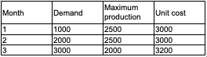

# Problem Statement (Lachtermacher, 2007)
A Maria Benz produz automóveis de passageiros para o mercado local e para exportação para diversos países. A primeira etapa do processo produtivo é a fabricação dos monoblocos, que depois são disponibilizados à linha de produção para montagem das demais peças. Maria Benz quer programar a produção para os próximos três meses. As estimativas de demanda, capacidade de produção e custo unitário de produção para cada um dos meses em questão estão ilustrados na tabela a seguir.

Devido às variações na capacidade de produção e no custo de fabricação entre os meses, a empresa pode produzir alguns monoblocos um mês ou mais antes do programado. A desvantagem é que tais monoblocos precisam ser armazenados até o mês em que serão consumidos, ao custo unitário de armazenamento de US$ 200,00/mês. O gerente de produção deseja saber quantos monoblocos deverão ser produzidos por mês para atender a demanda com o menor custo de produção e armazenamento possível. Modele esse problema como um problema de transporte e resolva-o usando o Solver.

# Objective
Exemplo simples de aplicação de pesquisa operacional. O objetivo do problema é minimizar o custo de produção.